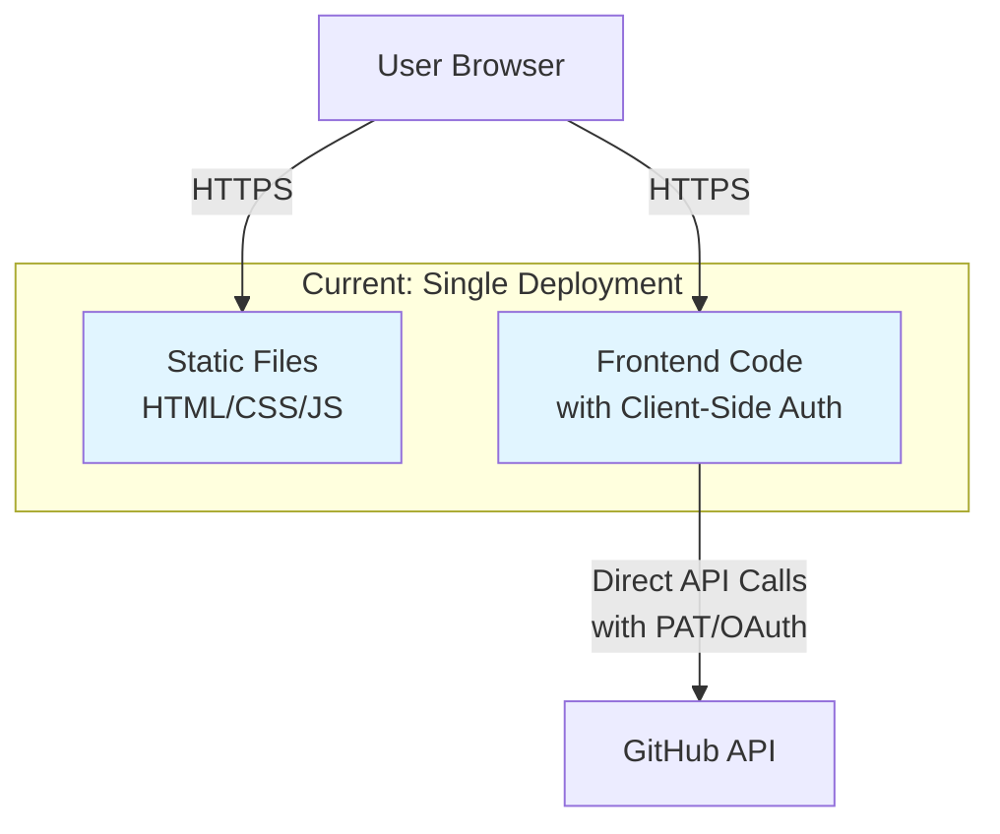
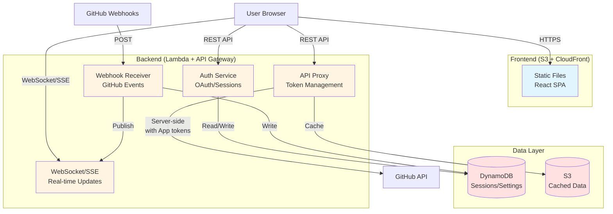
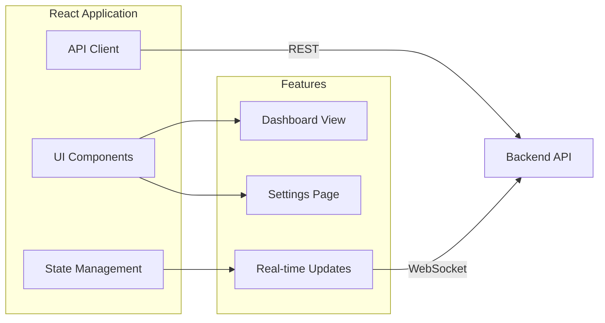
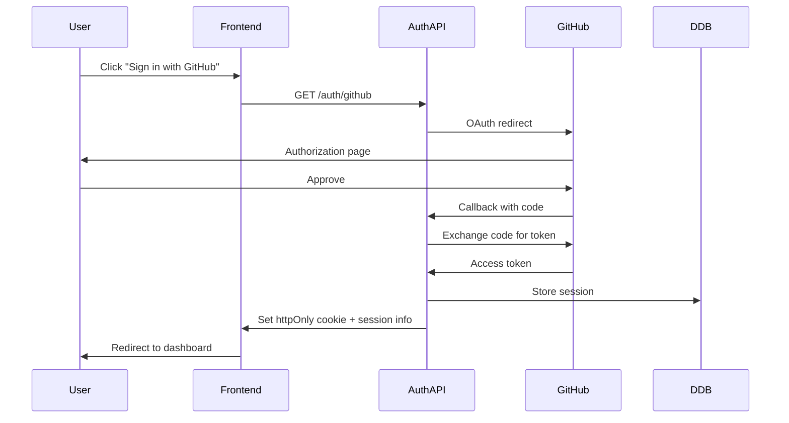
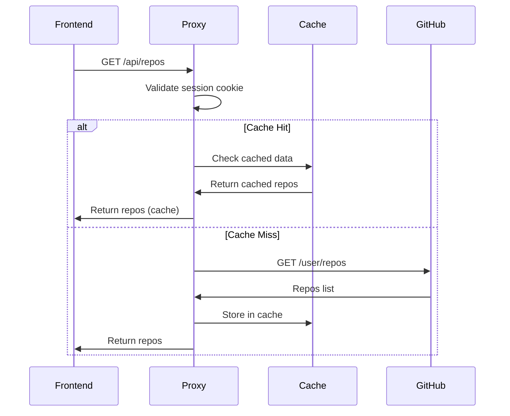
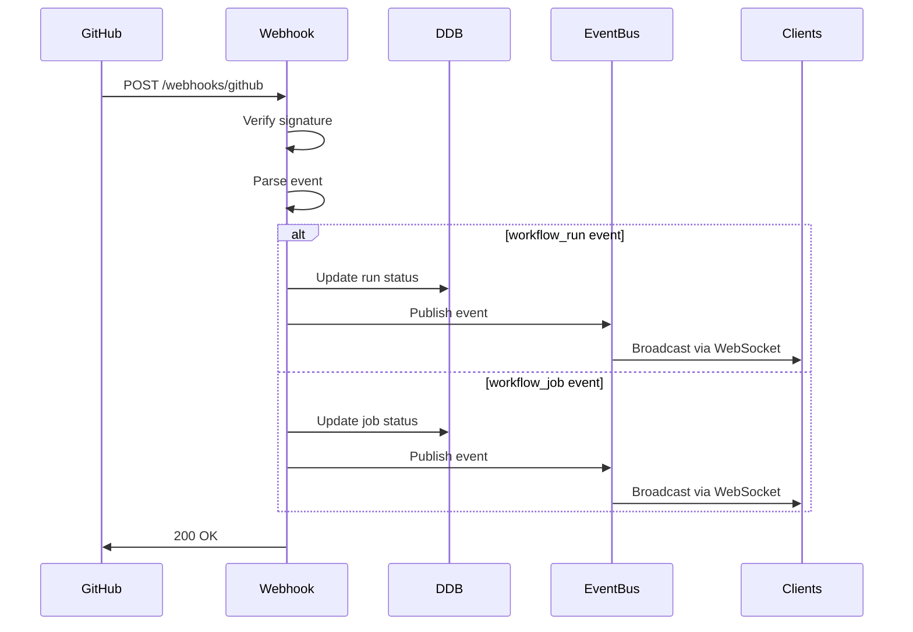
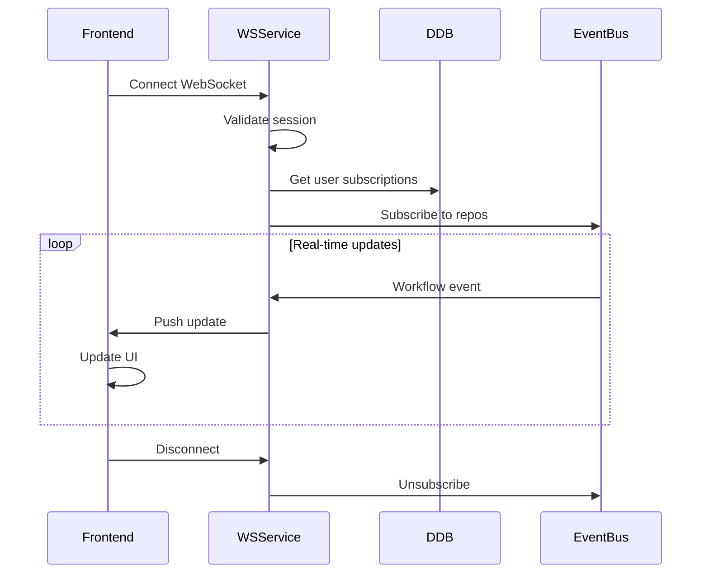

# Backend-Frontend Separation Architecture

## Current Architecture (Monolithic)



**Issues:**
- GitHub credentials stored in browser (localStorage)
- No server-side session management
- Can't use GitHub App private keys safely
- No webhook support
- CORS limitations
- Rate limiting per client

---

## Proposed Architecture (Microservices)

**Architecture Style:** Microservices with serverless compute (Lambda)

Each backend service is independently deployable and scalable:
- **Authentication Service** - User sessions and OAuth
- **API Proxy Service** - GitHub API gateway with caching
- **Webhook Receiver** - Inbound event processing
- **Real-time Service** - Outbound event broadcasting



---

## Component Breakdown

### Frontend (actions-dashboard)


**Responsibilities:**
- UI rendering and user interactions
- Client-side routing
- WebSocket/SSE connection management
- Local state management
- No credential storage

---

### Backend API (actions-dashboard-lambdas)

#### 1. Authentication Service

**Purpose:** Handles user authentication via GitHub OAuth and manages secure session storage.

**What it does:**
- Manages OAuth flow with GitHub
- Creates and validates user sessions
- Stores encrypted tokens server-side
- Issues secure httpOnly cookies
- Handles token refresh

**Flow Diagram:**


**Endpoints:**
- `GET /auth/github` - Initiate OAuth flow
- `GET /auth/callback` - OAuth callback handler
- `POST /auth/logout` - Clear session
- `GET /auth/session` - Get current session info

**Storage:**
```
DynamoDB Table: user-sessions
{
  sessionId: "uuid",
  userId: "github-user-id",
  accessToken: "encrypted-token",
  refreshToken: "encrypted-token",
  expiresAt: timestamp,
  createdAt: timestamp
}
```

---

#### 2. API Proxy Service

**Purpose:** Acts as a secure intermediary between frontend and GitHub API with intelligent caching.

**What it does:**
- Proxies GitHub API requests with server-side tokens
- Implements response caching to reduce API calls
- Manages rate limits across all users
- Handles token refresh automatically
- Aggregates and batches requests for efficiency

**Flow Diagram:**


**Endpoints:**
- `GET /api/repos` - List user repositories
- `GET /api/repos/:owner/:repo/runs` - Get workflow runs
- `GET /api/repos/:owner/:repo/workflows` - Get workflows
- `GET /api/user` - Get current user info
- `POST /api/repos/:owner/:repo/runs/:id/rerun` - Rerun workflow

**Features:**
- Server-side GitHub API calls
- Response caching (S3/DynamoDB)
- Rate limit management
- Token refresh handling
- Request batching

---

#### 3. Webhook Receiver

**Purpose:** Receives and processes GitHub webhook events in real-time for instant UI updates.

**What it does:**
- Receives GitHub webhook POST requests
- Verifies webhook signatures for security
- Parses and processes workflow/job events
- Updates cached workflow status in DynamoDB
- Publishes events to connected clients via WebSocket
- Deduplicates and handles retry logic

**Flow Diagram:**


**Endpoints:**
- `POST /webhooks/github` - GitHub webhook receiver

**Events Handled:**
- `workflow_run` - Workflow started/completed
- `workflow_job` - Job started/completed
- `push` - New commits
- `pull_request` - PR opened/closed

---

#### 4. Real-time Service (WebSocket/SSE)

**Purpose:** Maintains persistent connections to push live workflow updates to users instantly.

**What it does:**
- Manages WebSocket/SSE connections for each user
- Validates session and subscribes to user's repositories
- Broadcasts workflow events from webhooks to connected clients
- Handles connection lifecycle (connect, disconnect, reconnect)
- Provides fallback from WebSocket to SSE for compatibility

**Flow Diagram:**


**Protocol Options:**
1. **WebSocket** (preferred)
   - Full duplex communication
   - Lower latency
   - Better for high-frequency updates

2. **Server-Sent Events (SSE)** (fallback)
   - Simpler implementation
   - Better browser compatibility
   - One-way server→client

---

## Data Models

### DynamoDB Tables

#### Sessions Table
```
Table: user-sessions
PK: sessionId (String)
Attributes:
  - userId: String
  - githubToken: String (encrypted)
  - githubRefreshToken: String (encrypted)
  - expiresAt: Number (timestamp)
  - createdAt: Number (timestamp)
  - lastAccessedAt: Number (timestamp)

GSI: userId-index
  - PK: userId
  - SK: createdAt
```

#### User Settings Table
```
Table: user-settings
PK: userId (String)
Attributes:
  - selectedRepos: List<Map>
    - name: String
    - owner: String
    - category: String
  - pinnedRepos: List<String>
  - theme: String
  - autoRefresh: Boolean
  - notificationPreferences: Map
  - createdAt: Number
  - updatedAt: Number
```

#### Workflow Cache Table
```
Table: workflow-cache
PK: repoId (String)
SK: runId (String)
Attributes:
  - status: String
  - conclusion: String
  - workflowName: String
  - branch: String
  - commitMessage: String
  - triggeredAt: Number
  - updatedAt: Number
  - ttl: Number (auto-expire)
```

---

## Infrastructure Changes

### Current Structure
```
_services/
  actions-dashboard/          # Frontend + Infrastructure
    src/                      # React app
    infra/                    # Terraform (frontend + lambda)
    
  actions-dashboard-lambdas/  # Lambda functions
    lambdas/                  # Lambda code
    infra/                    # Terraform
```

### Proposed Structure (Microservices)
```
_services/
  actions-dashboard/
    src/                      # React app only
    infra/                    # Terraform for S3 + CloudFront
    
  actions-dashboard-backend/
    services/
      auth/                   # Authentication microservice
        src/
        tests/
        Dockerfile            # Optional: container support
      api-proxy/              # API proxy microservice
        src/
        tests/
      webhooks/               # Webhook receiver microservice
        src/
        tests/
      realtime/               # Real-time microservice
        src/
        tests/
    shared/                   # Shared libraries
      auth-utils/
      models/
      validators/
    infra/                    # Terraform for all services
      modules/
        lambda/
        api-gateway/
        dynamodb/
```

---

## Migration Plan

### Phase 1: Backend Setup (Week 1-2)
1. Create new backend repo structure
2. Set up API Gateway with custom domain
3. Deploy DynamoDB tables
4. Implement authentication endpoints
5. Test OAuth flow

### Phase 2: API Proxy (Week 2-3)
1. Implement GitHub API proxy endpoints
2. Add caching layer
3. Add rate limiting
4. Update frontend to use proxy
5. Test with real data

### Phase 3: Webhooks (Week 3-4)
1. Set up webhook receiver
2. Configure GitHub App webhooks
3. Implement event processing
4. Test webhook delivery

### Phase 4: Real-time (Week 4-5)
1. Implement WebSocket service
2. Add event broadcasting
3. Update frontend for real-time updates
4. Test connection handling

### Phase 5: Migration & Cleanup (Week 5-6)
1. Migrate users to new auth
2. Remove old lambda from frontend repo
3. Update documentation
4. Performance testing
5. Security audit

---

## API Specification

### Authentication Endpoints

```yaml
/auth/github:
  get:
    summary: Initiate GitHub OAuth
    responses:
      302:
        description: Redirect to GitHub
        
/auth/callback:
  get:
    summary: OAuth callback
    parameters:
      - name: code
        in: query
        required: true
    responses:
      302:
        description: Redirect to dashboard
        headers:
          Set-Cookie:
            schema:
              type: string
              example: session=xxx; HttpOnly; Secure
              
/auth/logout:
  post:
    summary: Logout user
    responses:
      200:
        description: Session cleared
        
/auth/session:
  get:
    summary: Get current session
    responses:
      200:
        description: Session info
        content:
          application/json:
            schema:
              type: object
              properties:
                userId: string
                username: string
                avatarUrl: string
                expiresAt: number
```

### API Proxy Endpoints

```yaml
/api/repos:
  get:
    summary: List user repositories
    security:
      - cookieAuth: []
    responses:
      200:
        description: Repository list
        content:
          application/json:
            schema:
              type: array
              items:
                type: object
                properties:
                  id: number
                  name: string
                  owner: object
                  description: string
                  
/api/repos/{owner}/{repo}/runs:
  get:
    summary: Get workflow runs
    parameters:
      - name: owner
        in: path
        required: true
      - name: repo
        in: path
        required: true
      - name: per_page
        in: query
        schema:
          type: integer
          default: 30
    security:
      - cookieAuth: []
    responses:
      200:
        description: Workflow runs
```

### Real-time Endpoints

```yaml
/ws:
  get:
    summary: WebSocket connection
    description: Upgrade to WebSocket protocol
    security:
      - cookieAuth: []
    responses:
      101:
        description: Switching protocols
        
/events:
  get:
    summary: Server-Sent Events
    description: SSE stream for real-time updates
    security:
      - cookieAuth: []
    responses:
      200:
        description: Event stream
        content:
          text/event-stream:
            schema:
              type: string
```

---

## Security Considerations

### Current Issues
- ❌ GitHub tokens in browser localStorage
- ❌ No server-side validation
- ❌ Direct GitHub API calls from client
- ❌ No session management
- ❌ Private keys can't be used

### New Security Features
- ✅ HttpOnly cookies for sessions
- ✅ Server-side token storage (encrypted)
- ✅ GitHub App private keys stay on server
- ✅ CSRF protection
- ✅ Request signature verification
- ✅ Rate limiting per user
- ✅ Session expiration
- ✅ Secure WebSocket connections

---

## Cost Implications

### Current Costs
- S3 hosting: ~$1/month
- CloudFront: ~$5/month
- Lambda (minimal): ~$1/month

### New Costs
- S3 hosting: ~$1/month
- CloudFront: ~$5/month
- API Gateway: ~$3.50/million requests
- Lambda: ~$10-20/month (with webhooks)
- DynamoDB: ~$5-15/month
- **Total: ~$25-50/month**

### Cost Optimization
- Use Lambda reserved concurrency
- DynamoDB on-demand pricing
- CloudFront caching
- API response caching
- S3 Intelligent-Tiering

---

## Performance Improvements

| Metric | Current | Proposed | Improvement |
|--------|---------|----------|-------------|
| Initial Page Load | 2-3s | 1-2s | 50% faster |
| API Response Time | 500ms-2s | 100-300ms | 70% faster |
| Real-time Updates | 30s polling | <1s push | 97% faster |
| Rate Limit Impact | Per client | Shared | Better usage |
| Cache Hit Rate | 0% | 80-90% | Huge improvement |

---

---

## Microservices Benefits

### Advantages
✅ **Independent Deployment** - Deploy auth changes without touching webhooks
✅ **Isolated Scaling** - Scale webhook receiver separately during high traffic
✅ **Technology Flexibility** - Could use different runtimes per service if needed
✅ **Team Autonomy** - Different developers can own different services
✅ **Fault Isolation** - Webhook failure doesn't break API proxy
✅ **Clear Boundaries** - Each service has single responsibility

### Considerations
⚠️ **Increased Complexity** - More moving parts to manage
⚠️ **Distributed Debugging** - Need good logging/tracing across services
⚠️ **Network Latency** - Inter-service communication overhead
⚠️ **Testing Complexity** - Need integration tests across services
⚠️ **Operational Overhead** - More deployment pipelines and monitoring

### Mitigation Strategies
- **API Gateway** - Single entry point, request routing
- **CloudWatch Logs + X-Ray** - Centralized logging and distributed tracing
- **EventBridge** - Decoupled event-driven communication
- **Shared libraries** - Common code for auth validation, error handling
- **Infrastructure as Code** - Terraform for consistent deployments

---

## Next Steps

1. **Review this architecture** - Gather feedback on microservices approach
2. **Set up backend repo** - Create infrastructure for all services
3. **Implement auth first** - Foundation for everything
4. **Incremental rollout** - Deploy one service at a time
5. **Monitor & iterate** - Measure improvements per service

---

## Questions to Consider

1. **WebSocket vs SSE?** 
   - WebSocket for bidirectional if needed
   - SSE simpler if only server→client

2. **DynamoDB vs RDS?**
   - DynamoDB better for serverless
   - Simpler data model

3. **API Gateway vs ALB?**
   - API Gateway better for Lambda
   - Built-in features (auth, throttling)

4. **Session storage?**
   - DynamoDB for serverless
   - Redis/ElastiCache for performance

5. **GitHub App vs OAuth?**
   - Both - OAuth for users
   - GitHub App for backend operations
