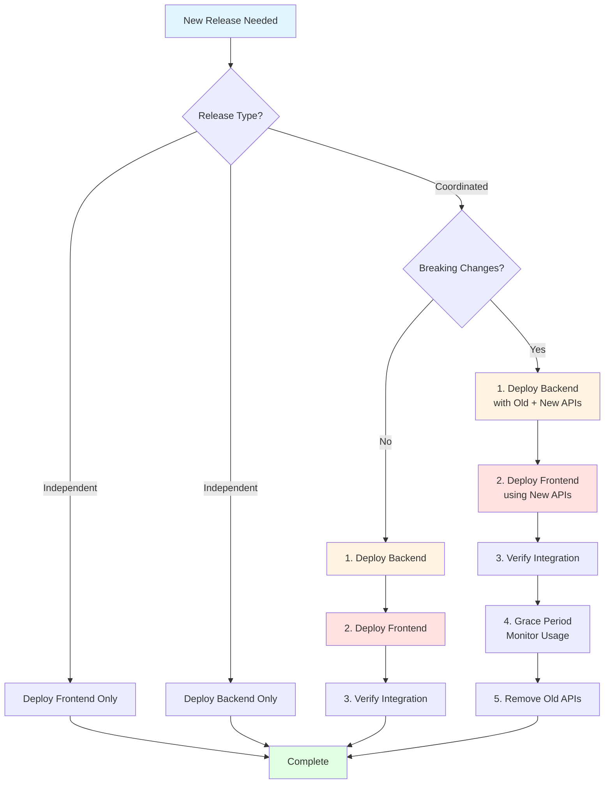
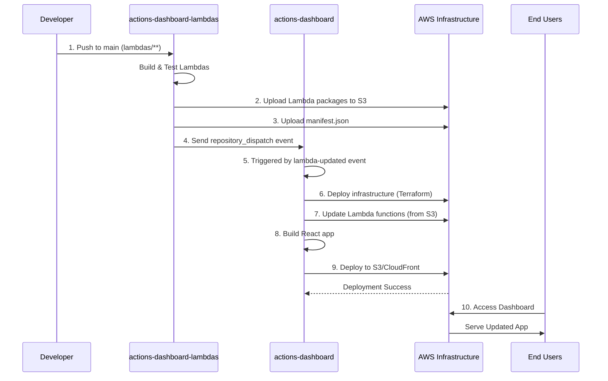
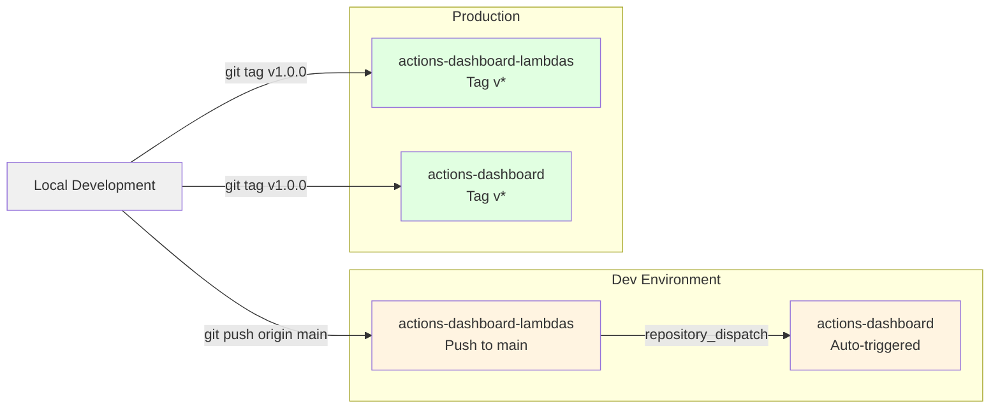

# Deployment Guide

Deployment options for the h3ow3d Actions Dashboard.

## Contents

- [Release Strategy](#release-strategy)
- [Development Server](#development-server)

---

## Release Strategy

The Actions Dashboard consists of two repositories that work together:

### Repositories

**Frontend: `actions-dashboard`**
- React single-page application
- Static assets (HTML, CSS, JS)
- Deployed to S3 + CloudFront
- Release frequency: As needed (UI changes, features)

**Backend: `actions-dashboard-lambdas`**
- Lambda functions for backend services
- API Gateway endpoints
- DynamoDB tables
- Deployed via Terraform
- Release frequency: As needed (API changes, bug fixes)

### Coordinated Releases



**Independent Deployments**
- Frontend and backend can deploy independently
- Backward compatibility maintained through API versioning
- Frontend gracefully handles missing backend features

**Breaking Changes**
When API contracts change:
1. Deploy backend with new + old endpoints
2. Deploy frontend using new endpoints
3. Remove old endpoints after grace period

**Deployment Order**
For coordinated releases:



1. **Backend first** - Lambdas repo builds and uploads Lambda packages
2. **Trigger frontend** - Lambdas repo dispatches `lambda-updated` event (dev only)
3. **Frontend deploys** - Updates Lambda functions from manifest, then deploys UI
4. **Manual production** - Tag both repos independently for production deployment

### Versioning

**Frontend** (`actions-dashboard`)
- Push to `main` branch → auto-deploys to **Development**
- Push tag `v*` (e.g., `v1.2.3`) → auto-deploys to **Production**
- Receives `repository_dispatch` event from lambdas repo to update Lambda code

**Backend** (`actions-dashboard-lambdas`)
- Push to `main` branch (with changes in `lambdas/**`) → builds and uploads to **Development**
- Push tag `v*` → builds and uploads to **Production**  
- After dev deployment, triggers frontend repo via `repository_dispatch` event
- Terraform workspace determines environment (dev/prod)

### Rollback Strategy

**Production Rollback**
```bash
# Frontend: Re-push previous tag to trigger deployment
git tag -d v1.2.3          # Delete bad tag locally
git push origin :v1.2.3    # Delete bad tag remotely
git push origin v1.2.2     # Re-push previous tag

# Backend: Re-push previous tag
cd ../actions-dashboard-lambdas
git tag -d v1.2.3
git push origin :v1.2.3
git push origin v1.2.2
```

**Development Rollback**
```bash
# Revert main branch and push
git revert HEAD
git push origin main       # Triggers automatic deployment
```

### Environment Strategy



| Environment | Trigger | Frontend | Backend | Coordination |
|------------|---------|----------|---------|-------------|
| **Development** | Push to `main` | Auto-deploy + update Lambdas | Build & upload packages | Backend triggers frontend via `repository_dispatch` |
| **Production** | Tag `v*` | Auto-deploy | Build & upload packages | Manual - tag both repos independently |

---

## Development Server

Run locally for development:

```bash
make dev
# or
npm run dev
```

Dashboard available at http://localhost:3001

---

## Help

If you run into issues:
- Check the [GitHub Issues](https://github.com/h3ow3d/h3ow3d-actions-dashboard/issues)
- Review the main README for setup questions

