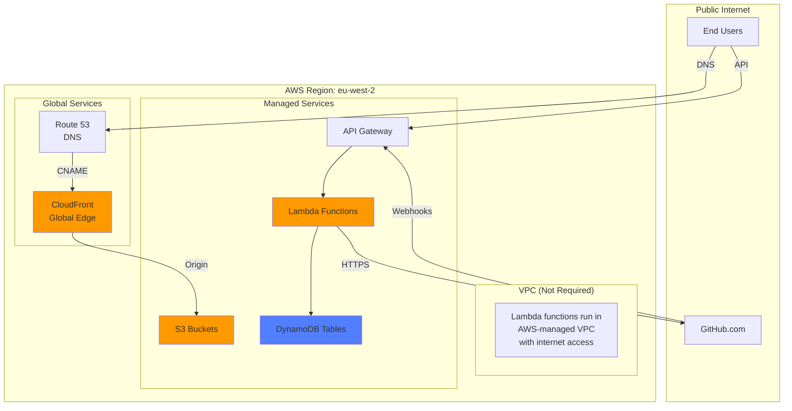

# Infrastructure

AWS infrastructure components for the Actions Dashboard microservices architecture.

## Overview

- **Region**: `eu-west-2` (London)
- **Frontend**: S3 + CloudFront
- **Backend**: API Gateway + Lambda
- **Data**: DynamoDB tables
- **Deployment**: GitHub Actions + Terraform

---

## Complete Infrastructure Diagram

```mermaid
graph TB
    subgraph "Client Layer"
        Browser[Web Browser]
    end
    
    subgraph "CDN & DNS"
        R53[Route 53<br/>DNS]
        CF[CloudFront<br/>Global CDN]
        ACM[ACM Certificate<br/>TLS/SSL]
    end
    
    subgraph "Frontend (S3)"
        S3Web[S3 Bucket<br/>Static Website]
        S3Assets[index.html<br/>app.js<br/>styles.css]
    end
    
    subgraph "API Gateway"
        APIGW[API Gateway<br/>HTTP API]
        CustomDomain[Custom Domain<br/>api.domain.com]
    end
    
    subgraph "Backend Services (Lambda)"
        AuthLambda[Auth Service<br/>λ oauth-start<br/>λ oauth-callback]
        ProxyLambda[API Proxy<br/>λ repos<br/>λ workflows<br/>λ runs]
        WebhookLambda[Webhook Receiver<br/>λ github-webhook]
        RealtimeLambda[Real-time Service<br/>λ websocket]
    end
    
    subgraph "Data Layer"
        DDB[(DynamoDB)]
        Sessions[Sessions Table<br/>PK: sessionId]
        Settings[User Settings<br/>PK: userId]
        Cache[Workflow Cache<br/>PK: repoId<br/>SK: runId]
        
        DDB --- Sessions
        DDB --- Settings
        DDB --- Cache
    end
    
    subgraph "External Services"
        GitHub[GitHub API<br/>api.github.com]
        GitHubWebhook[GitHub Webhooks]
        GitHubApp[GitHub App<br/>Authentication]
    end
    
    subgraph "Deployment Pipeline"
        GHAFrontend[GitHub Actions<br/>actions-dashboard]
        GHABackend[GitHub Actions<br/>actions-dashboard-lambdas]
        S3Artifacts[S3 Bucket<br/>Lambda Artifacts]
    end
    
    %% Client connections
    Browser -->|HTTPS| R53
    R53 -->|Route| CF
    CF -->|TLS| ACM
    CF -->|Origin| S3Web
    S3Web --> S3Assets
    
    Browser -->|API Calls| CustomDomain
    CustomDomain -->|Route| APIGW
    Browser -.->|WebSocket| APIGW
    
    %% API Gateway to Lambdas
    APIGW -->|/auth/*| AuthLambda
    APIGW -->|/api/*| ProxyLambda
    APIGW -->|/webhooks/*| WebhookLambda
    APIGW -->|/ws| RealtimeLambda
    
    %% Lambda to Data
    AuthLambda -->|Read/Write| Sessions
    ProxyLambda -->|Read| Cache
    ProxyLambda -->|Read| Settings
    WebhookLambda -->|Write| Cache
    RealtimeLambda -->|Read| Sessions
    
    %% External integrations
    AuthLambda -->|OAuth| GitHubApp
    ProxyLambda -->|API Calls| GitHub
    GitHubWebhook -->|POST Events| WebhookLambda
    
    %% Real-time flow
    WebhookLambda -.->|Publish Events| RealtimeLambda
    RealtimeLambda -.->|Push Updates| Browser
    
    %% Deployment
    GHABackend -->|Upload| S3Artifacts
    GHABackend -.->|Trigger| GHAFrontend
    GHAFrontend -->|Update| AuthLambda
    GHAFrontend -->|Update| ProxyLambda
    GHAFrontend -->|Update| WebhookLambda
    GHAFrontend -->|Update| RealtimeLambda
    GHAFrontend -->|Deploy| S3Web
    
    %% Styling
    style Browser fill:#e1f5ff
    style CF fill:#ff9900
    style S3Web fill:#ff9900
    style APIGW fill:#ff9900
    style AuthLambda fill:#ff9900
    style ProxyLambda fill:#ff9900
    style WebhookLambda fill:#ff9900
    style RealtimeLambda fill:#ff9900
    style DDB fill:#527FFF
    style GitHub fill:#24292e
    style GitHubWebhook fill:#24292e
    style GitHubApp fill:#24292e
```



---

## Component Details

### 1. Frontend Layer

**S3 + CloudFront Static Website**
- **S3 Bucket**: Hosts compiled React application
  - Bucket name: `actions-dashboard-{env}-website`
  - Objects: `index.html`, `assets/*.js`, `assets/*.css`
  - Versioning: Enabled for rollback capability
  - Access: CloudFront Origin Access Control (OAC)

- **CloudFront Distribution**:
  - Global CDN with edge locations
  - Custom domain: `dashboard.example.com`
  - TLS certificate from ACM (us-east-1)
  - Cache behaviors:
    - `index.html`: `max-age=0, must-revalidate`
    - `*.js`, `*.css`: `max-age=31536000, immutable`
  - Origin failover: Not configured (single origin)

- **Route 53**:
  - A record alias to CloudFront
  - Managed by Terraform

**Cache Strategy**:
- Static assets: 1 year cache (`immutable`)
- HTML entry point: No cache (`must-revalidate`)
- CloudFront invalidation on deploy: `/*`

---

### 2. API Gateway

**HTTP API Configuration**
- **Type**: HTTP API (lower cost, better performance vs REST API)
- **Custom Domain**: `api.dashboard.example.com`
- **TLS Certificate**: ACM certificate in same region as API Gateway
- **CORS**: Configured for frontend domain
- **Authorization**: Session cookie validation in Lambda

**Routes**:
```
GET    /auth/github               → oauth-start lambda
GET    /auth/callback             → oauth-callback lambda
POST   /auth/logout               → oauth-callback lambda
GET    /auth/session              → oauth-callback lambda

GET    /api/repos                 → api-proxy lambda
GET    /api/repos/{owner}/{repo}  → api-proxy lambda
GET    /api/user                  → api-proxy lambda
POST   /api/repos/.../runs/.../rerun → api-proxy lambda

POST   /webhooks/github           → webhook-receiver lambda

GET    /ws                        → websocket lambda (upgrade)
GET    /events                    → websocket lambda (SSE)
```

**Integration**:
- Lambda proxy integration
- Request validation in Lambda
- Payload format: 2.0

---

### 3. Lambda Functions

#### Auth Service
**Functions**:
- `oauth-start`: Initiates GitHub OAuth flow
- `oauth-callback`: Handles OAuth callback

**Configuration**:
- Runtime: Node.js 20.x
- Memory: 256 MB
- Timeout: 30 seconds
- Environment variables:
  - `GITHUB_CLIENT_ID`
  - `GITHUB_CLIENT_SECRET`
  - `CALLBACK_URL`
  - `SESSIONS_TABLE_NAME`

**IAM Permissions**:
- DynamoDB: `PutItem`, `GetItem`, `DeleteItem` on sessions table

#### API Proxy Service
**Function**: `api-proxy`

**Configuration**:
- Runtime: Node.js 20.x
- Memory: 512 MB (higher for caching)
- Timeout: 60 seconds
- Environment variables:
  - `GITHUB_APP_ID`
  - `GITHUB_PRIVATE_KEY`
  - `SESSIONS_TABLE_NAME`
  - `CACHE_TABLE_NAME`
  - `SETTINGS_TABLE_NAME`

**IAM Permissions**:
- DynamoDB: `GetItem`, `Query` on sessions/settings/cache tables
- DynamoDB: `PutItem`, `UpdateItem` on cache table (for storing responses)

#### Webhook Receiver
**Function**: `webhook-receiver`

**Configuration**:
- Runtime: Node.js 20.x
- Memory: 256 MB
- Timeout: 30 seconds
- Environment variables:
  - `WEBHOOK_SECRET`
  - `CACHE_TABLE_NAME`
  - `EVENT_BUS_NAME` (for publishing events)

**IAM Permissions**:
- DynamoDB: `PutItem`, `UpdateItem` on cache table
- EventBridge: `PutEvents` (for publishing to WebSocket clients)

#### Real-time Service
**Function**: `websocket-handler`

**Configuration**:
- Runtime: Node.js 20.x
- Memory: 256 MB
- Timeout: 900 seconds (15 min for WebSocket connections)
- Environment variables:
  - `SESSIONS_TABLE_NAME`
  - `CONNECTIONS_TABLE_NAME`

**IAM Permissions**:
- DynamoDB: `GetItem` on sessions table
- DynamoDB: `PutItem`, `DeleteItem` on connections table
- API Gateway Management API: `PostToConnection` (send messages to clients)

**Lambda Deployment**:
- Artifacts stored in S3 bucket: `actions-dashboard-{env}-lambda-artifacts`
- Versioning: Git SHA in filename `lambda-{function}-{sha}.zip`
- Deployment manifest: `manifest.json` in S3 tracks all versions

---

### 4. Data Layer (DynamoDB)

#### Sessions Table
**Table**: `actions-dashboard-{env}-sessions`

**Schema**:
```
Partition Key: sessionId (String)

Attributes:
- userId: String (GitHub user ID)
- accessToken: String (encrypted)
- refreshToken: String (encrypted)
- expiresAt: Number (Unix timestamp)
- createdAt: Number
- lastAccessedAt: Number

GSI: userId-index
  PK: userId
  SK: createdAt

TTL: expiresAt (auto-delete expired sessions)
```

**Capacity**:
- Billing mode: PAY_PER_REQUEST (on-demand)
- Estimated reads: 1000/day
- Estimated writes: 500/day

#### User Settings Table
**Table**: `actions-dashboard-{env}-user-settings`

**Schema**:
```
Partition Key: userId (String)

Attributes:
- selectedRepos: List (repo configurations)
- pinnedRepos: List<String>
- theme: String
- autoRefresh: Boolean
- notificationPreferences: Map
- createdAt: Number
- updatedAt: Number
```

**Capacity**:
- Billing mode: PAY_PER_REQUEST
- Estimated reads: 500/day
- Estimated writes: 100/day

#### Workflow Cache Table
**Table**: `actions-dashboard-{env}-workflow-cache`

**Schema**:
```
Partition Key: repoId (String, format: owner/repo)
Sort Key: runId (String)

Attributes:
- status: String (queued, in_progress, completed)
- conclusion: String (success, failure, cancelled)
- workflowName: String
- branch: String
- commitMessage: String
- commitSha: String
- triggeredAt: Number
- completedAt: Number
- updatedAt: Number

GSI: status-index
  PK: status
  SK: updatedAt

TTL: ttl (auto-delete after 30 days)
```

**Capacity**:
- Billing mode: PAY_PER_REQUEST
- Estimated reads: 5000/day
- Estimated writes: 2000/day (webhooks + API updates)

#### WebSocket Connections Table
**Table**: `actions-dashboard-{env}-connections`

**Schema**:
```
Partition Key: connectionId (String)

Attributes:
- userId: String
- connectedAt: Number
- subscribedRepos: List<String>

GSI: userId-index
  PK: userId
  SK: connectedAt

TTL: Set to connectionId timeout
```

---

### 5. External Integrations

#### GitHub App
**Configuration**:
**GitHub**:
- API calls via HTTPS to `api.github.com`
- Webhooks from GitHub to API Gateway `/webhooks/github`
- OAuth authentication via GitHub App

## Network Architecture



**Notes**:
- No VPC required - all services are serverless and managed by AWS
- Lambda functions have automatic internet access
- DynamoDB accessed via VPC endpoint (implicit)
- All traffic encrypted in transit

---

## Cost Estimation

**Monthly costs for moderate usage** (~1000 workflow runs/day):

| Service | Usage | Cost |
|---------|-------|------|
| **CloudFront** | 10 GB data transfer, 1M requests | $1.50 |
| **S3 (Website)** | 1 GB storage, 1M GET requests | $0.50 |
| **S3 (Lambda Artifacts)** | 100 MB storage, 1000 GET requests | $0.10 |
| **API Gateway** | 1M requests | $1.00 |
| **Lambda (Auth)** | 10K invocations, 256MB, 200ms avg | $0.20 |
| **Lambda (API Proxy)** | 100K invocations, 512MB, 500ms avg | $2.50 |
| **Lambda (Webhooks)** | 50K invocations, 256MB, 100ms avg | $0.50 |
| **Lambda (WebSocket)** | 5K connections, 256MB | $0.30 |
| **DynamoDB** | 500K reads, 100K writes | $2.00 |
| **Route 53** | 1 hosted zone, 1M queries | $0.90 |
| **ACM Certificates** | 2 certificates | $0.00 (free) |
| **CloudWatch Logs** | 5 GB ingestion, 30-day retention | $2.50 |
| **Total** | | **~$12/month** |

**Free Tier Coverage** (first 12 months):
- Lambda: 1M requests/month free
- DynamoDB: 25 GB storage, 200M requests free
- CloudFront: 50 GB transfer, 2M requests free
- **Estimated cost with free tier**: ~$5/month

---

## Disaster Recovery

**Backup Strategy**:
1. **DynamoDB**: Point-in-time recovery enabled (35-day retention)
2. **S3 Website**: Versioning enabled for rollback
3. **Lambda Code**: Git history + S3 artifact versioning
4. **Terraform State**: S3 backend with versioning

**Recovery Procedures**:
1. **Frontend rollback**: Re-deploy previous Git tag
2. **Backend rollback**: Update Lambda to previous S3 artifact version
3. **Database restore**: DynamoDB point-in-time recovery
4. **Complete rebuild**: Re-run Terraform from Git

**RTO/RPO**:
- Recovery Time Objective: < 15 minutes
- Recovery Point Objective: < 1 hour (DynamoDB PITR)

---

## Scalability

**Automatic Scaling**:
- **Lambda**: Scales to 1000 concurrent executions (default)
- **API Gateway**: Handles 10,000 req/sec (soft limit)
- **DynamoDB**: On-demand pricing scales automatically
- **CloudFront**: Global CDN handles traffic spikes

**Bottlenecks**:
- GitHub API rate limits: 5,000 req/hour per user
- WebSocket connections: Lambda concurrency limit
- DynamoDB hot partitions: Use composite keys

**Scaling Recommendations**:
- Implement aggressive caching for GitHub API responses
- Use Lambda reserved concurrency for critical functions
- Monitor DynamoDB partition key distribution
- Consider CloudFront caching for API responses

---

## Future Enhancements

1. **Multi-Region Deployment**:
   - Active-passive failover
   - Route 53 health checks
   - DynamoDB global tables

2. **Enhanced Monitoring**:
   - Custom CloudWatch dashboards
   - Real-time alerting via SNS
   - Distributed tracing with X-Ray

3. **Performance Optimization**:
   - Lambda@Edge for dynamic content
   - ElastiCache for hot data
   - API Gateway response caching

4. **Advanced Features**:
   - SQS for webhook event buffering
   - Step Functions for complex workflows
   - Cognito for additional auth providers

---

## Related Documentation

- [Architecture Overview](./ARCHITECTURE.md) - Microservices design and data models
- [Deployment Guide](./DEPLOYMENT.md) - CI/CD pipeline and release strategy
- [Analytics Setup](./ANALYTICS.md) - Plausible analytics integration
- [SEO Configuration](./SEO.md) - Meta tags and social sharing
Terraform Configuration

**State Backend**:
```hcl
# Frontend repo (actions-dashboard)
backend "s3" {
  bucket = "stackgobrr-terraform-state"
  key    = "services/actions-dashboard/{env}/terraform.tfstate"
  region = "eu-west-2"
}

# Backend repo (actions-dashboard-lambdas)
backend "s3" {
  bucket = "stackgobrr-terraform-state"
  key    = "utils/actions-dashboard/{env}/actions-dashboard-lambdas.tfstate"
  region = "eu-west-2"
}
```

**Workspaces**:
- `dev` - Development environment
- `prod` - Production environment